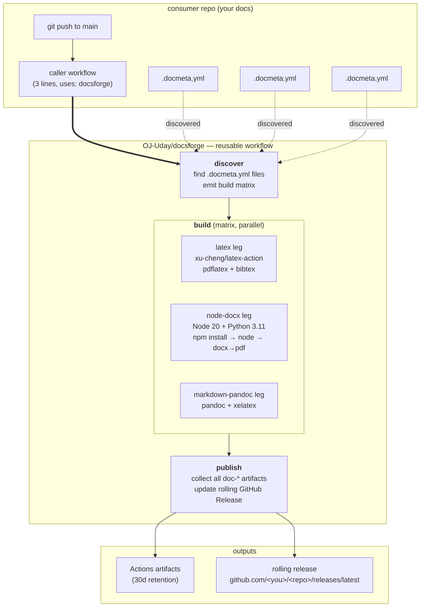

# docsforge

<p align="center">
  
  
  
</p>

> **Auto-build every document in your repo.** Drop a `.docmeta.yml` next to
> your `main.tex`, `generate.cjs`, or `paper.md`, add one line to a workflow,
> and every push produces fresh PDFs (and .docx where applicable) attached
> to a rolling GitHub Release.

**No local install. No LaTeX on your laptop. Edit in the browser, download
from Releases.** Works for one doc or twenty. Add new docs by adding one
file.

---

## Why?

Every serious document — a thesis, a resume, a whitepaper, a project
report — deserves the same treatment good code gets: version-controlled
source, reproducible builds, and a stable download URL that never rots.
docsforge is the smallest useful pipeline that gives you that:

- **Edit from anywhere** — github.com's browser editor works on a phone.
- **One rolling `latest` release** — bookmarks never break; recruiters get
  a stable URL.
- **Polyglot** — LaTeX, Word/`.docx` via [`docx`](https://www.npmjs.com/package/docx),
  or Markdown via [`pandoc`](https://pandoc.org). Mix them in one repo.
- **Zero YAML boilerplate per doc.** Discovery scans for `.docmeta.yml`
  and builds every doc it finds, in parallel.
- **Rerun anytime** — every workflow has a manual `workflow_dispatch`
  trigger.

---

## Quick start (60 seconds)

**Step 1.** In your repo, add a workflow at `.github/workflows/build.yml`:

```yaml
name: Build docs
on:
  push: { branches: [main] }
  workflow_dispatch:
permissions:
  contents: write
jobs:
  build:
    uses: OJ-Uday/docsforge/.github/workflows/build-docs.yml@main
```

**Step 2.** Next to each document, add a tiny `.docmeta.yml`:

```yaml
# thesis/.docmeta.yml
type: latex           # latex | node-docx | markdown-pandoc
entry: main.tex       # path relative to this file
output_name: My_Thesis
needs_bibtex: true    # LaTeX only
```

**Step 3.** Push. That's it. Your PDFs appear at:

```
https://github.com/<you>/<repo>/releases/latest
```

Named exactly what you put in `output_name`.

---

## Supported doc types

| Type | Source language | Outputs | Runtime |
| --- | --- | --- | --- |
| **`latex`** | `.tex` files (+ optional `bibtex`) | `<output_name>.pdf` | TeX Live (full) via [`xu-cheng/latex-action`](https://github.com/xu-cheng/latex-action) |
| **`node-docx`** | Node.js script using the [`docx`](https://www.npmjs.com/package/docx) library | `<output_name>.docx`, `<output_name>.pdf` (if `docx_to_pdf.py` sibling exists) | Node 20 + Python 3.11 |
| **`markdown-pandoc`** | Any pandoc-flavoured Markdown | `<output_name>.pdf` | pandoc + xelatex |

Each doc's builder runs in its own parallel job. Two docs = two concurrent
jobs. Fail-fast is off — one broken doc doesn't stop the others.

More builders (typst, asciidoctor, quarto…) are easy to add — see
[`docs/BUILDERS.md`](docs/BUILDERS.md).

---

## Architecture

The workflow is one YAML file with three sequential jobs. Each doc gets
its own parallel `build` matrix leg, so N docs → N concurrent jobs.



### The three jobs, in detail

**1. `discover`** (single job on `ubuntu-latest`)

- Runs `find . -name '.docmeta.yml'` (excluding `node_modules/` and
  `.git/`).
- For each file, parses `type`, `entry`, `output_name`, `needs_bibtex`
  with `yq`.
- Emits a JSON matrix on the job output.
- Missing `type` or `entry` → warning + skip that doc. **Fail-open by
  design.** One malformed doc must not block the others.

**2. `build`** (matrix of N jobs, parallel)

Each matrix leg receives `{dir, type, entry, output_name, needs_bibtex}`
and runs the branch matching `type`. `if:` guards on each step ensure
only the relevant runtime is set up for each leg — no wasted install
time.

**LaTeX leg.** Uses `xu-cheng/latex-action@v3` which pulls a docker
image with full TeX Live baked in. `bibtex` runs automatically between
passes when `needs_bibtex: true`. Compile flags:
`-pdf -f -interaction=nonstopmode -halt-on-error`.

**node-docx leg.** Sets up Node 20 + Python 3.11. Then:
- **Lockfile guard** — if `package-lock.json` references a private
  registry (jfrog/artifactory/nexus/verdaccio), it's deleted and
  `npm install` regenerates against `registry.npmjs.org`. Otherwise
  `npm ci` for determinism. This makes the pipeline robust against
  the common "I generated my lockfile on a corporate laptop" failure
  mode.
- `NPM_CONFIG_REGISTRY=https://registry.npmjs.org/` is forced in the
  environment.
- Runs `node <entry>` to produce a `.docx`.
- If a `docx_to_pdf.py` sibling exists, installs `python-docx` +
  `reportlab` and runs it to produce a matching `.pdf`.

**markdown-pandoc leg.** `apt install pandoc texlive-xetex ...` then
`pandoc <entry> -o <output>.pdf --pdf-engine=xelatex -V
geometry:margin=1in -V mainfont="Latin Modern Roman"`.

**After the type-specific step**, a common "Stage outputs" step copies
whatever `.pdf` / `.docx` files landed in the doc's folder into
`/tmp/docsforge-artifacts/` under the doc's `output_name`. Then
`actions/upload-artifact@v4` publishes it as `doc-<output_name>`.

**3. `publish`** (single job, `needs: [discover, build]`)

- Downloads every `doc-*` artifact (`actions/download-artifact@v4` with
  `pattern: doc-*` + `merge-multiple: true`).
- Emits a job-summary table (Markdown, rendered on the run page):
  filename + size for each output.
- `softprops/action-gh-release@v2` publishes to `tag_name: latest` with
  `make_latest: "true"`. Overwrites the same tag; consumers' bookmarks
  never rot.

### Concurrency + cancellation

The workflow declares:

```yaml
concurrency:
  group: docsforge-${{ github.ref }}
  cancel-in-progress: true
```

Two quick pushes → the older run is cancelled mid-flight so the
release always reflects the latest commit. No lost minutes on a race.

### Permissions

The reusable workflow declares `permissions: contents: write` for
`publish` only. `discover` and `build` need no special permissions. The
consumer inherits this; there is no secret they need to configure
because `GITHUB_TOKEN` is scoped automatically per repo.

---

## `.docmeta.yml` schema — quick reference

```yaml
# Required
type: latex | node-docx | markdown-pandoc
entry: <path relative to this file>

# Optional
output_name: <string>          # default: name of this folder
needs_bibtex: true | false     # latex only; default false
```

See [`docs/DOCMETA.md`](docs/DOCMETA.md) for the full schema and the
default behaviour of every field.

---

## Consumer workflow inputs

The reusable workflow accepts a few knobs:

```yaml
jobs:
  build:
    uses: OJ-Uday/docsforge/.github/workflows/build-docs.yml@main
    with:
      release_tag: latest              # default
      release_name: "Latest build"     # default
      commit_previews: true            # default; auto-commit PNG previews
      artifact_retention_days: 30      # default
```

---

## Example

See [`examples/resume-node-docx/`](examples/resume-node-docx/) for a fully
working `.docx`+`.pdf` resume built with the `docx` library, complete with
a Workday-passing ATS layout. Uses `type: node-docx`.

---

## Design notes

- **Reusable workflow, not composite action.** A reusable workflow gets
  its own runner, its own permission scopes, and its own concurrency
  group. Cleaner isolation than piling steps onto the caller's job — a
  broken doc build won't spill onto the caller's other jobs, and the
  caller's `permissions:` can stay minimal.
- **Discovery via `.docmeta.yml`**, not workflow inputs. Add a new doc
  by adding one file, not by editing YAML wiring. Scales to 20+ docs
  in one repo without the workflow file growing.
- **One rolling release**, not one per commit. Bookmarks don't rot;
  recruiters get a stable link. If you want per-commit versioned
  releases, fork and tweak two lines in the `publish` job.
- **No dependencies on your part.** The workflow installs everything
  it needs on the runner. Your repo doesn't need a `Dockerfile`, a
  `flake.nix`, or a devcontainer.
- **Fail-open discovery.** A malformed `.docmeta.yml` emits a
  `::warning::` and is skipped; other docs still build. The pipeline
  is a doc-building tool, not a compliance gate.
- **Lockfile survivor mode.** `node-docx` builds detect a
  `package-lock.json` pointing at a private registry (jfrog /
  artifactory / nexus / verdaccio) and regenerate against public npm
  automatically. This is the single most common way a doc pipeline
  breaks when it's set up on a corporate laptop and run on a
  cloud runner.
- **Parallelism is free.** N docs → N concurrent build legs. The
  matrix isn't `fail-fast: true` — one broken doc doesn't take out
  the other N-1.

### How it compares

| Alternative | Where it's better | Where docsforge is better |
| --- | --- | --- |
| **Overleaf** | Live preview, real-time collab | Multi-format (not just LaTeX), no vendor lock-in, git-native history, free for private repos |
| **A hand-written Actions YAML** | Full control, do exactly what you want | Zero copy-paste when you have multiple docs; discovery makes adding a new doc a one-file change |
| **`peaceiris/actions-gh-pages`** | Great for HTML sites | This publishes PDFs and DOCX to Releases (stable URLs, not overwritten HTML) |
| **CircleCI / Jenkins with a shared library** | More powerful build primitives | Zero infra to run; every GitHub repo already has Actions |

### Extending: adding a new builder type

Adding e.g. a `typst` builder is ~15 lines in
`.github/workflows/build-docs.yml`:

```yaml
- name: (typst) install
  if: matrix.type == 'typst'
  run: |
    curl -fsSL "https://github.com/typst/typst/releases/latest/download/typst-x86_64-unknown-linux-musl.tar.xz" \
      | tar -xJ && sudo mv typst-*/typst /usr/local/bin/

- name: (typst) build
  if: matrix.type == 'typst'
  working-directory: ${{ matrix.dir }}
  run: typst compile "${{ matrix.entry }}" "${{ matrix.output_name }}.pdf"
```

Then document the new type in `docs/DOCMETA.md` and add an
`examples/whatever-typst/` folder that demonstrates it. Send a PR.
Rule: no builder that needs secrets to install.

---

## Contributing

PRs welcome. To add a new builder type:

1. Add a `matrix.type == '<yours>'` branch in
   `.github/workflows/build-docs.yml`.
2. Document its expected `.docmeta.yml` shape in `docs/DOCMETA.md`.
3. Ideally add a working example under `examples/`.

Please don't add builders that require secrets to install — this workflow
runs with `contents: write` and nothing else on purpose.

---

## Licence

MIT. See [`LICENSE`](LICENSE).

Built by [@OJ-Uday](https://github.com/OJ-Uday). Not affiliated with
GitHub, Anthropic, Overleaf, or any of the tools this workflow orchestrates.
